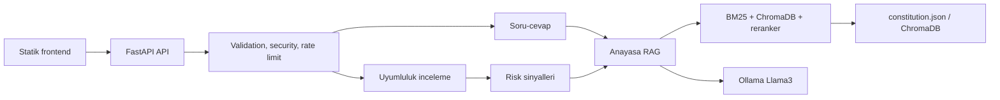

# AnayasalRAGai - Turkish Constitution RAG Assistant

  

**AnayasalRAGai - Turkish Constitution RAG Assistant** is a Retrieval-Augmented Generation system focused on the Constitution of the Republic of Turkiye, combining structured legal data, semantic search, and local AI assistance.

Designed for AI developers, legaltech builders, Turkish law researchers, RAG system designers, and students experimenting with trustworthy document-grounded assistants.

## Uyarı

Bu proje yasal tavsiye üretmez. Yanıtlar yapay zeka tarafından oluşturulur ve hatalı, eksik veya yanıltıcı olabilir. Resmî ve bağlayıcı bilgi için güncel mevzuat ve yetkili profesyonel kaynaklar kontrol edilmelidir.

## Lisans ve Kaynak Kullanımı

Bu sürümde dış depolardan kod, görsel, veri dosyası veya doküman metni kopyalanmamıştır. Yeni API, arayüz, deployment ve değerlendirme parçaları bu proje içinde özgün olarak yazılmıştır; ek atıf veya üçüncü taraf telif yükümlülüğü doğuracak bir aktarım yapılmamıştır.

## Features

- Local-first RAG workflow for Turkish constitutional text.
- Hybrid retrieval using keyword and vector search concepts.
- Structured Markdown and JSON legal data for machine-readable workflows.
- FastAPI backend foundation for legal question answering.
- Prompting strategy designed to stay close to the source context.
- Structured source citations, confidence labels, and reviewer notes inspired by legal AI guardrail workflows.
- Anayasal uyumluluk ve risk inceleme endpoint'i: politika, taslak veya olay metnini kaynaklı şekilde değerlendirir.
- Deterministik risk sinyali katmanı: eşitlik, kişisel veri, ifade özgürlüğü, mülkiyet, yargı yolu ve yaptırım temalarını işaretler.
- Capability ve statistics endpointleri ile canlı sistem durumu, limitler ve kullanım sayaçları.
- Docker, Docker Compose, Makefile, `.env.example` ve hafif regression evaluation scriptleri.
- Useful reference project for Turkish NLP, legal AI, and retrieval pipelines.
- Pydantic request validation, structured JSON hata formatı ve request ID takibi.
- Rate limiting, CORS yapılandırması, opsiyonel API key ve temel prompt injection filtresi.
- Hafif unit test altyapısı ve GitHub Actions CI başlangıcı.

## Mimari



## Depo Yapısı

- `backend/app.py`: FastAPI uygulaması, endpointler, middleware ve exception handlerlar.
- `backend/config.py`: Ortam değişkenlerinden okunan uygulama ayarları.
- `backend/security.py`: Input sanitization, rate limiting, API key ve HTTPS yönlendirme desteği.
- `backend/analysis.py`: Anayasal risk sinyalleri, analiz query builder ve risk durum hesaplama.
- `backend/exceptions.py`: Uygulama exception sınıfları ve ortak hata response formatı.
- `backend/schemas.py`: Pydantic request/response modelleri.
- `backend/rag.py`: RAG pipeline, retriever, prompt ve doğrulama akışı.
- `frontend/`: Statik web arayüzü.
- `data/`: Anayasa veri seti ve ChromaDB dosyaları.
- `data/eval_queries.json`: Hafif regression değerlendirme soru seti.
- `docs/`: Markdown anayasa metinleri.
- `scripts/`: Veri işleme ve arama yardımcıları.
- `tests/`: Unit testler.
- `Dockerfile`, `docker-compose.yml`, `Makefile`, `.env.example`: Yerel ve container tabanlı çalıştırma yardımcıları.

## Kurulum

Gereksinimler:

- Python 3.10+
- Ollama
- `llama3` modeli

```bash
python -m venv venv
venv\Scripts\activate
pip install -r requirements.txt
ollama pull llama3
```

Linux/macOS sanal ortam aktivasyonu:

```bash
source venv/bin/activate
```

## Çalıştırma

```bash
uvicorn backend.app:app --reload
```

Arayüz:

- `http://127.0.0.1:8000/`

API dokümantasyonu:

- `http://127.0.0.1:8000/docs`
- `http://127.0.0.1:8000/openapi.json`

## API

### `POST /api/v1/chat`

Geriye `answer`, `request_id`, kaynak parçaları ve review metadata döndürür. Eski frontend uyumluluğu için `POST /chat` de aynı endpoint olarak korunur.

```json
{
  "query": "Anayasa'nın 1. maddesi nedir?"
}
```

Başarılı response:

```json
{
  "answer": "...",
  "request_id": "...",
  "confidence": "source_grounded",
  "citations": [
    {
      "article_id": "1",
      "title": "Madde 1",
      "excerpt": "Madde 1, Fıkra 1: Türkiye Devleti bir Cumhuriyettir.",
      "paragraph_index": 0,
      "source": "constitution.json"
    }
  ],
  "review_notes": [
    "Bu çıktı karar veya hukuki görüş değil; madde metni üzerinden insan denetimi gerektirir."
  ]
}
```

`confidence` değerleri:

- `verified`: Modelin tırnak içi alıntıları getirilen bağlamda birebir doğrulanmıştır.
- `source_grounded`: Yanıt kaynak parçalarıyla desteklenmiştir ancak birebir alıntı doğrulaması yoktur.
- `needs_review`: Yanıt veya kaynak eşleşmesi ek kontrol gerektirir.

Hata response formatı:

```json
{
  "error": {
    "code": "request_validation_error",
    "message": "İstek gövdesi doğrulanamadı.",
    "details": []
  },
  "request_id": "..."
}
```

### `GET /health`

Uygulama sürümü ve RAG yüklenme durumunu döndürür.

### `POST /api/v1/analyze`

Politika, taslak düzenleme veya olay anlatımını Anayasa bağlamında kaynaklı risk incelemesine tabi tutar.

```json
{
  "subject": "Belediye kamera izleme politikası",
  "description": "Belediye meydanlarda kişisel veri işleyen yüz tanıma destekli kamera sistemi kurmak istiyor.",
  "mode": "policy"
}
```

Başarılı response `answer`, `confidence`, `status`, `risk_level`, `signals`, `citations` ve `review_notes` alanlarını döndürür.

`status` değerleri:

- `no_clear_issue`: Getirilen bağlam ve otomatik sinyaller belirgin risk göstermedi.
- `review_recommended`: İnceleme önerilir.
- `high_risk`: Yüksek dikkat gerektiren anayasal tema bulundu.
- `needs_review`: Kaynak veya doğrulama katmanı ek insan kontrolü istedi.

### `GET /api/v1/capabilities`

Aktif özellikleri, endpointleri, giriş limitlerini ve guardrail durumunu döndürür.

### `GET /api/v1/statistics`

Uptime, RAG yüklenme durumu, istek sayaçları ve aktif limitleri döndürür.

### `GET /api/health/models`

LLM ve embedding model durumunu döndürür.

## Güvenlik Ayarları

| Değişken | Varsayılan | Açıklama |
| --- | --- | --- |
| `ANAYASA_CORS_ORIGINS` | localhost originleri | Virgülle ayrılmış izinli origin listesi |
| `ANAYASA_RATE_LIMIT_ENABLED` | `true` | Rate limit aç/kapat |
| `ANAYASA_RATE_LIMIT_REQUESTS` | `20` | Rate limit pencere başına istek sayısı |
| `ANAYASA_RATE_LIMIT_WINDOW_SECONDS` | `60` | Rate limit penceresi |
| `ANAYASA_QUERY_MIN_LENGTH` | `3` | Soru minimum uzunluğu |
| `ANAYASA_QUERY_MAX_LENGTH` | `1500` | Soru maksimum uzunluğu |
| `ANAYASA_ANALYSIS_MIN_LENGTH` | `20` | İnceleme metni minimum uzunluğu |
| `ANAYASA_ANALYSIS_MAX_LENGTH` | `5000` | İnceleme metni maksimum uzunluğu |
| `ANAYASA_API_KEY` | boş | Doluysa `x-api-key` veya `Authorization: Bearer` zorunlu olur |
| `ANAYASA_ENFORCE_HTTPS` | `false` | Production ortamında HTTPS yönlendirmesi |
| `ANAYASA_EAGER_LOAD_RAG` | `true` | Başlangıçta RAG yükleme |

Production önerisi:

```bash
set ANAYASA_ENV=production
set ANAYASA_API_KEY=guclu-bir-anahtar
set ANAYASA_ENFORCE_HTTPS=true
set ANAYASA_CORS_ORIGINS=https://alan-adiniz.example
```

## Test ve Kalite

```bash
pytest --cov=backend tests/
python scripts/evaluate_queries.py
black .
flake8 . --max-line-length=120
mypy backend/
```

Pre-commit hook kurulumu:

```bash
pre-commit install
```

CI başlangıcı `.github/workflows/ci.yml` içinde bulunur.

Makefile kısayolları:

```bash
make install
make run
make test
make eval
```

Container kullanımı:

```bash
copy .env.example .env
docker compose up --build
```

## Veri ve Persistence

ChromaDB verisi `data/` altında tutulur. Production kullanımında bu dizin düzenli yedeklenmelidir. RAG index yeniden üretimi gerekiyorsa ilgili ChromaDB dizini yedek alındıktan sonra silinip uygulama yeniden başlatılabilir.

## Sorun Giderme

- `RAG sistemi başlatılamadı.`: Ollama çalışıyor mu ve `llama3` modeli yüklü mü kontrol edin.
- İlk yanıt çok yavaş: Embedding modeli ve ChromaDB index ilk kullanımda hazırlanıyor olabilir.
- `request_validation_error`: `query` alanı boş, çok kısa veya çok uzun olabilir.
- `security_error`: Soru prompt injection filtresine takılmış olabilir.
- `rate_limit_exceeded`: Kısa sürede çok fazla istek gönderilmiştir.

## Yol Haritası

- Redis cache ve response time metrikleri.
- Kalıcı ChromaDB backup ve migration scriptleri.
- Prometheus metrikleri ve query analytics.
- Multi-turn conversation, madde geçmişçesi ve daha ayrıntılı citation doğrulama.
- Çok kaynaklı hukuk veri setlerine kontrollü genişleme.

## SEO Keywords

Turkish Constitution RAG, Anayasa AI assistant, legal RAG system, Turkish legaltech AI, retrieval augmented generation Python, FastAPI RAG, Ollama legal assistant, Turkiye Cumhuriyeti Anayasasi AI

## GitHub Topics

`ai`, `rag`, `legaltech`, `turkish-constitution`, `python`, `fastapi`, `ollama`, `nlp`

## Repository

[View on GitHub](https://github.com/AybarsBarut/AnayasalRAGai)
